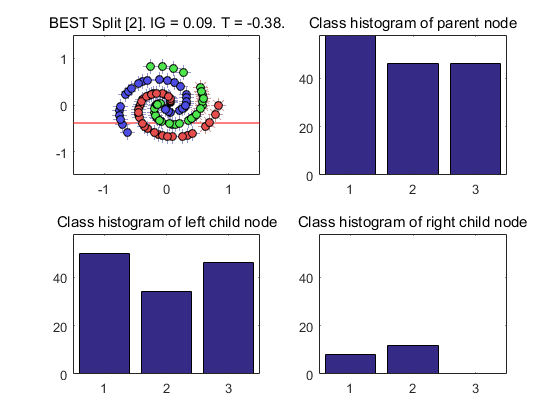
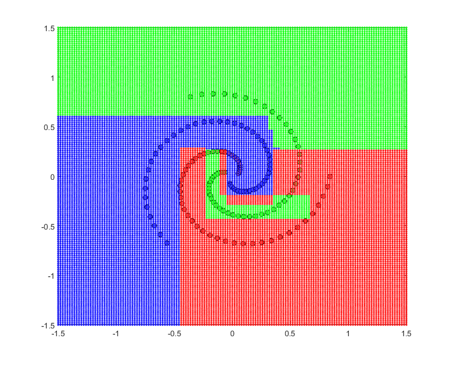
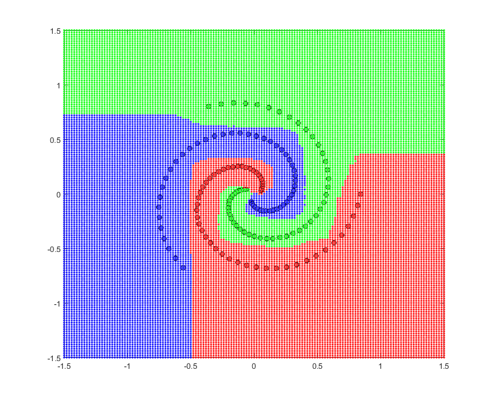
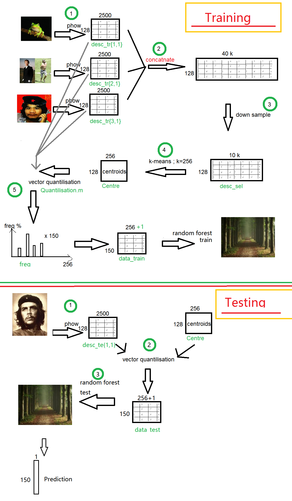

# MLCV  

# some answer to the question 

-----

## Q1

*Given the training data set, we first generate multiple data subsets by Bagging (Boostrap
Aggregating). Show e.g. **four data subsets** , and **discuss** the results, and** the way** you did bagging
e.g. the size of each data subset, whether it was with or without replacement.*

We randomly select equal number of examples with replacement from the data set. We expect to have 63% unique samples. To be specific, the data_train is 150*3, the size of each data sub is also 150*3. The reason why the spiral look different is because some of the data in sub dataset is repeated. 

*Now we take one of the data subsets generated above, and grow a tree by recursively splitting*
*the data.*

*Split the first (i.e. root) node. We try a few of split feature functions randomly chosen (given a split*
*function type e.g. axis-aligned) and thresholds (we can vary the value of ρ, i.e. the degree of*
*randomness parameter), decide the best one in terms of information gain. **Show the split functions**,*
*the respective **class histograms of the node** and its two children nodes, and measure the*
***information gains**. Discuss the results.*

**we wrote linear split function ** 

We use log2 to calaculate information gain, we also modify getIG.m 

Higher information gain contain more informations using this feature will simplify the tree structure. 

Here we tried 3 split funcitons. And picked the one which gave the highest information fain 

The splitfunction is -0.38, and node with second feature greater than -0.38 will be move to left child node, any node with 2nd feature less than -0.38 will be moved to right child node. Highest Information Gain among the 3 trials  is 0.09 and it give us the above result. 

*We now recursively split the nodes in the way above to grow the tree. When the tree growth is*
*done, we save the class distributions in the leaf nodes. **Visualise **the class distributions of some*
*leaf nodes, and **discuss **the results. What **stopping criteria** did you use? Explain the reasons*
*behind* 

Some leaf only have one label, but some has many labels. 

There are 3 stoping criterias, one is all the example in leaf node belong to one class, the other is the depth of the leaf reach the maximum we set the 3^rd criteria is the number of instance in a node is lesser than 5. 

In this example, the maximum tree depth we set is 5. subplot 2,2  reaches the max depth. The rest fix the first criteria. 

# Q2 

----

*Q2. [10] Evaluating Decision Forest on the test data*
*Using the random forest trained above, we evaluate novel data points in the test dataset. Let us*
*grab the few data points (for instance, the points given below) and evaluate them one by one by*
*the learnt RF. Show and discuss the results. **Visualise** the class distributions of the leaf nodes*
*which the data point arrives at and t**he averaged class distribution**.*

>> test_point = [-.5 -.7; .4 .3; -.7 .4; .5 -.5]; 
>>
>> 

 

 

 *We evaluate all the data points in the dense 2D grid, and **visualise** their classification results,*
**colour encoded** 

param.num = 4;         % Number of trees
param.depth = 5;        % trees depth
param.splitNum = 10;     % Number of split functions to try
param.split = 'IG'; 

 

 **Try** *different parameter values of RF and see the effects. RF has a few of important parameters,*
*which need to be set to achieve good results. Here we try changing the number of trees, the depth*
*of trees, and the degree of randomness parameter. Show and **discuss** the results for different*
*parameter values* 

 

param.num = 100;         % Number of trees
param.depth = 9;        % trees depth
param.splitNum = 3;     % Number of split functions to try
param.split = 'IG'; 

increase tree number avoid overfitting 

increase depth increase accuracy 

# Q3

##flowchart of bag of words 

Accuracy so far = 73.3%  